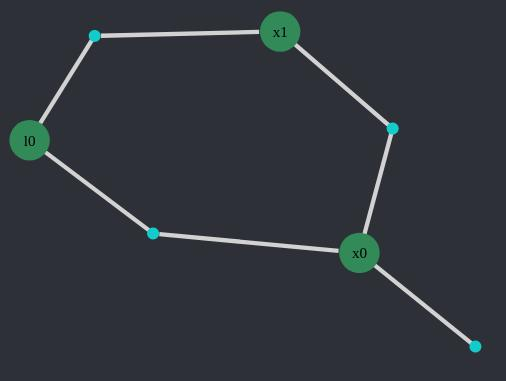

# Drawing Graphs

All graph rendering is done with `GraphPlot`, and plotting is available if it is installed and imported before DFG is imported. Install `GraphPlot` using the following command:

```julia
using Pkg
Pkg.install("GraphPlot")
```

Then bring `GraphPlot` in before DFG:

```julia
using GraphPlot
using DistributedFactorGraphs
```

Any factor graph can then be drawn by calling `dfgPlot`:

```julia
# Construct graph
dfg = GraphsDFG{SolverParams}(params=SolverParams())
v1 = addVariable!(dfg, :x0, ContinuousScalar, labels = [:POSE], solvable=1)
v2 = addVariable!(dfg, :x1, ContinuousScalar, labels = [:POSE], solvable=1)
v3 = addVariable!(dfg, :l0, ContinuousScalar, labels = [:LANDMARK], solvable=1)
prior = addFactor!(dfg, [:x0], Prior(Normal(0,1)))
f1 = addFactor!(dfg, [:x0; :x1], LinearConditional(Normal(50.0,2.0)), solvable=1)
f1 = addFactor!(dfg, [:l0; :x0], LinearConditional(Normal(40.0,5.0)), solvable=1)
f1 = addFactor!(dfg, [:l0; :x1], LinearConditional(Normal(-10.0,5.0)), solvable=1)

# Plot graph
dfgplot(dfg)
```



```@docs
dfgplot
```

## Rendering to PDF

The graph can be rendered to PDF or JPG in the following way:

```julia
# Save to PDF
using Compose
draw(PDF("/tmp/graph.pdf", 16cm, 16cm), dfgplot(dfg))
```

## More Information

More information at [GraphPlot.jl](https://github.com/JuliaGraphs/GraphPlot.jl)
